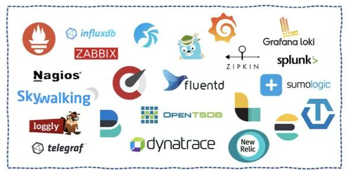
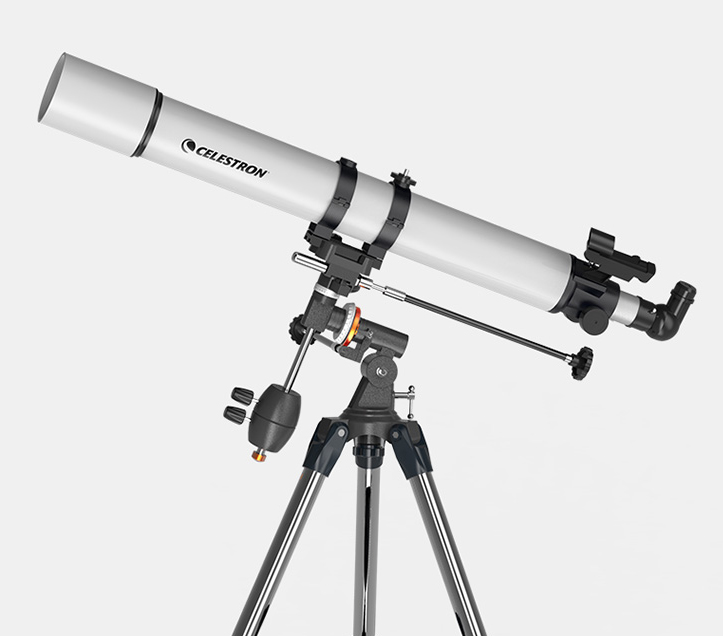

# 文章之Sig成立

 社区陆陆续续成立了包括K8s ，Istio ，Envoy等SIG， 终于等到了我们的Observability \(可观察性\) SIG，希望各位对可观察性感兴趣的小伙伴能够加入进来，一起探索、分享、实践业内相关产品。

### Observability \(可观察性\) 是什么

依据其他学科成熟稳定的概念迁移至软件工程领域内，从控制理论到动力系统，从传统监控到云原生指标观测的平滑过渡。

关于更多可观察性概念，请移步社区SIG下的[可观察性的定义、与传统监控的区别及其联系。](https://i.cloudnative.to/observability/prologue/definition)

### Observability SIG的成立原因

由于各大服务厂商的分散性、分布式系统的复杂性、三大支柱领域的弱关联性、复杂的云上环境及其带来的服务架构变迁引发的一系列问题迫使需要出现可以将杂乱无序的数据流整合成一套完整 从埋点、收集、传输、存储等 符合某种标准厂商的协议，继而在此之上完成更好的其他服务集成。

同时，我们也能看到，三大支柱领域内每个指标所对应开源产品的实现既有较大的重合，也有各自的侧重点。作为使用者，存储的复杂性，架构的多样性，标准协议实现的不统一性等等问题都在困扰着广大开发者，却又无可奈何。

等等原因使得目前仍旧没有较为中立、成熟且乐于分享的兴趣小组，所以我们成立了。

### Observability SIG的成立

SIG最重要的是定位，由一群热爱的小伙伴组成的特别兴趣小组，其价值该如何衡量？答案是不可衡量。

好了，较为官方的表达来了，我们是：由社区组织、聚集对日志、追踪、监控等可观察性支柱产品及相关领域在云原生环境下学习、研究、工作、分享的开发者而形成的特别兴趣小组。

除此之外，我们致力于推荐相关产品落地和最佳实践的展示，也包括该领域下相关开源产品生产经验的分享，同时我们希望拥有更多不同专业领域经验的人群为广大开发者在此领域下提供专业的指导和分享，更希望获得帮助的同学能够积极反馈社区，共建生态。

### Observability SIG的责任

我们在不违反法律和相关道德的前提下，应当具备这样的责任：

1. 分享、交流、实践与可观察性领域相关可生产使用的最佳实践和相关产品。
2. 在云原生领域下，不断审查、确定和修复相关产品对生产环境的影响。
3. 为不同产品的讨论、对比和使用经验提供一个与各大厂商无关的兴趣小组。
4. 致力于公开、透明、包容和理性的特别兴趣小组。

### 如何加入Observability SIG

最好的方式永远都是加入我们的 WeChat Group，确定整个特别兴趣小组是如何运作和相互配合的，欢迎各位在群里正确发表合理的言论和正确参与相关讨论。

当然，我们希望同时也鼓励大家共同参与，其定义本就为在此领域下有相关兴趣的众多开发者提供一个中立的特别兴趣开发小组。一千个人眼中有一千个哈姆雷特，我们希望在这里得到思想的碰撞、专业认知的塑造和相关经验的分享。

具体请移步SIG[欢迎页面](https://i.cloudnative.to/observability/)，按照指引即可。

### 我们如何运作

我们没有固定的工作方式和任务，个人思考的内容和业内的各种分享都是我们的取材模板，运作流程大致如下：

* SIG某些重点文章、文档需要讨论、协商、确定之后才会翻译。
* 翻译前会将内容放在Github Observability Sig 仓库的Issue区。
* 公有的Github组织，会有对应的仓库存储各自实践的成果。
* 社区SIG与其他该领域较为权威的官方定时做分享、互动和宣传。
* 定期、定时、线上分享关于个人的想法和经验等，并将其核心内容记录为文章。
* 公有的WeChat Group会保证一直存在。

### 小结

通过上面，我想大家对于云原生 可观察性 SIG 有了较为清晰的认识了。无论你是开源领域的活跃者、可观察性领域从业者、还是致力于从事这一领域的爱好者或者其他。想了解开源 SIG 是如何运作的并想获取更多可观察性领域的专业知识，那加入 Observability Sig 就是一个绝佳的机会！

